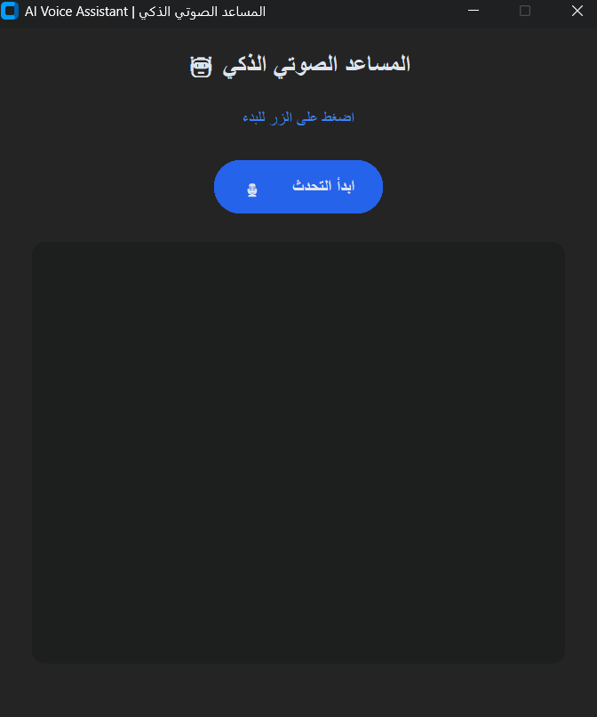
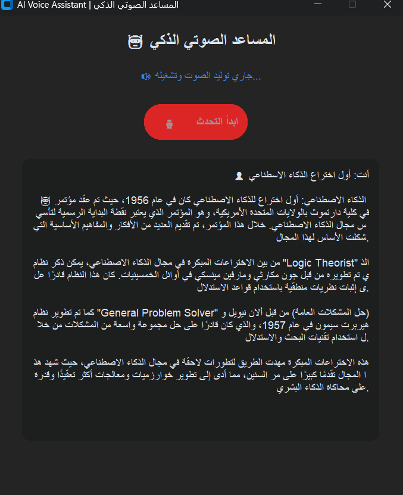

# 🎙️ AI-voice-assistant with Cohere & Whisper

An intelligent voice assistant that integrates **Whisper** for speech recognition, **Cohere AI** for natural language understanding, and **gTTS** (Google Text-to-Speech) to deliver seamless, interactive voice responses in Arabic.

---

## 🔑 Prerequisites & Setup (API Key)

To run this application, you need to obtain a **Cohere API Key**:

> ⚠️ **Important:** Ensure you generate your API key and set it up in your environment or within a `.env` file for the assistant to function properly.
> 
> 🔗 **Get your API Key here:** [Cohere Dashboard - API Keys](https://dashboard.cohere.com/api-keys)

---

## ✨ Key Features

* 🎙️ **Speech-to-Text:** Accurate voice recognition powered by Whisper and the SpeechRecognition library.
* 🧠 **Smart Context Processing:** High-quality response generation using Cohere AI models.
* 🔊 **Text-to-Speech:** Clear Arabic audio output powered by `gTTS`, `pygame`, and `arabic-reshaper`.
* 💻 **Modern GUI:** Clean and responsive user interface built with `customtkinter`.

---

## 📸 Interface & Preview

### 1️⃣ Main Application Interface


### 2️⃣ Interaction & Question Sample


---

## 🎥 Video Demo

Watch the voice assistant in action and hear how it processes and reads answers aloud:

[](https://youtube.com/shorts/4C_h__ag-Hw?feature=share)


---

## 📁 Repository Structure

| File Name | Description |
| :--- | :--- |
| `voiceToText.py` | Main application script handling GUI, audio input, AI processing, and TTS output. |
| `requirements.txt` | List of required Python packages and dependencies. |
| `intarface.png` | Screenshot of the main interface layout. |
| `pic1.png` | Screenshot showcasing an interactive Q&A session. |
| `README.md` | Comprehensive documentation for the repository. |

---

## 🚀 Getting Started

### 1️⃣ Clone the Repository
```bash
git clone [https://github.com/JanaAlnutaify/YOUR-REPOSITORY-NAME.git](https://github.com/JanaAlnutaify/YOUR-REPOSITORY-NAME.git)
cd YOUR-REPOSITORY-NAME
